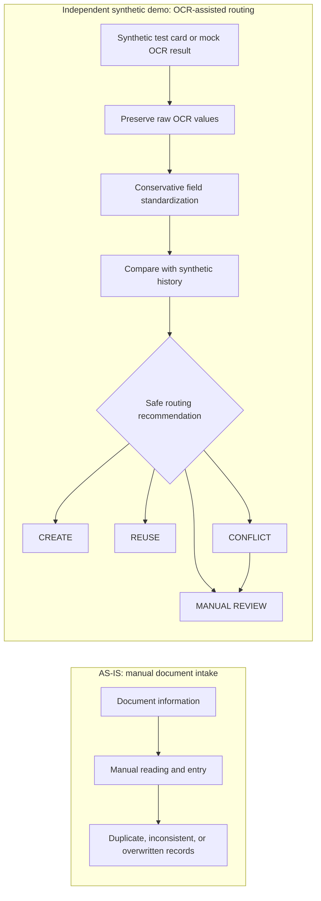

# Human-in-the-Loop Passport OCR Routing Demo

A lightweight, privacy-preserving portfolio demo that turns OCR output into an
explainable workflow recommendation: create a new record, reuse a historical
record, flag a conflict, or request human review.

**This is an independent demonstration using only synthetic data. It is not a
production EDMS, a copy of an employer or client system, or evidence of
production OCR accuracy.**

## The business problem

OCR can read text from a travel document, but the output may be incomplete,
misformatted, or inconsistent with a historical customer record. Treating that
output as confirmed data can create duplicates, overwrite identity information,
or hide a conflict that needs human judgment.

This demo asks one focused question:

> How can an OCR-assisted workflow preserve uncertain evidence, standardize it
> conservatively, and safely route a case before a customer record is changed?

## From manual risk to safe routing



All OCR-derived values remain `UNVERIFIED`. The demo recommends a workflow
route; it never confirms identity or silently overwrites a historical record.

## Relationship to prior FDE experience

This project is a deliberately narrow, independently rebuilt companion demo
inspired by general experience in an on-site Forward Deployed Engineer (FDE)
engagement for travel-document operations.

In the prior work, I contributed to a P0 single-document OCR workflow inside an
existing web application. My responsibilities included translating the workflow
into data objects and rules, preserving raw and normalized values, matching
historical records, protecting against conflicts, and keeping OCR-derived
results unverified until reviewed.

The public demo recreates only the transferable decision layer with a different,
minimal technical stack. It does **not** reuse source code, document layouts,
customer data, service credentials, internal thresholds, or production metrics.

| FDE design concern | Independent demo expression |
|---|---|
| OCR output is uncertain | Raw OCR text remains visible and `UNVERIFIED` |
| Formatting should not change identity meaning | Normalization is conservative and testable |
| Historical records should not be silently overwritten | Conflict cases route to human review |
| Ambiguity needs an operational owner | Each route includes a visible reason |
| A P0 scope should be small and testable | One synthetic document flow and 60 mock cases |

## What the demo does

1. Generates an obviously synthetic, non-valid test card.
2. Runs local open-source Tesseract OCR on that card.
3. Preserves the OCR text and parses the known synthetic layout.
4. Standardizes names, passport numbers, dates, and categorical fields.
5. Compares the normalized values against synthetic historical customers.
6. Routes each case to `CREATE`, `REUSE`, `CONFLICT`, or `MANUAL_REVIEW`.
7. Displays the decision reason, candidate evidence, and three workflow metrics.

## Routing rules

| Condition | Route | Human review | Reasoning |
|---|---|---:|---|
| Name, passport number, or date of birth is missing or ambiguous | `MANUAL_REVIEW` | Yes | A core identity key is unsafe to use |
| One passport-number match and no available identity-field conflict | `REUSE` | No | The case can reuse the historical record without overwrite |
| Passport number matches but name, date of birth, sex, or birthplace conflicts | `CONFLICT` | Yes | A potentially unsafe identity mismatch exists |
| Name and date of birth match but passport number differs | `MANUAL_REVIEW` | Yes | Possible reissue; a person must decide |
| Required fields are complete and no historical match exists | `CREATE` | No | A new unverified record can be created |

## Data and validation

The repository contains two separate demonstration tracks:

- **Live OCR sample:** one clearly labeled synthetic test card processed locally
  with Tesseract. It demonstrates integration only; no OCR accuracy claim is
  made from this sample.
- **Synthetic batch data:** 24 synthetic historical customers and 60 mock OCR
  cases used to test the routing workflow.

The batch has 18 intended reuse cases, 14 create cases, 12 conflict cases, and
16 manual-review cases. A separate `test_case_expectations.csv` file acts only
as a test oracle; the routing engine never reads it to make a decision.

Current synthetic-batch results:

| Metric | Definition | Illustrative result |
|---|---|---:|
| Critical-field completeness | Mean share of name, passport number, and date of birth present after normalization | 91.1% |
| Automatic reuse rate | `REUSE` cases divided by all processed cases | 30.0% |
| Human-review rate | Cases marked for review divided by all processed cases | 46.7% |

These are generated demonstration results, not operational findings.

## Streamlit walkthrough

Run the app and open `http://localhost:8501`.

1. Click **Run OCR on synthetic card** to run local OCR.
2. Compare the raw OCR text with the standardized fields.
3. Scroll to **Historical matching and review routing**.
4. Try `CASE-018` for a safe reuse case, `CASE-021` for a new record,
   `CASE-038` for a conflict, and `CASE-047` for manual review.
5. Review the workflow metrics at the bottom.

See [demo_walkthrough.md](docs/demo_walkthrough.md) for a 60-90 second demo
script and narration.

## Repository structure

```text
passport-ocr-record-matching-demo/
├── app.py                         # Streamlit interface
├── src/                           # OCR adapter, parsing, normalization, matching, metrics
├── scripts/                       # Synthetic data and routing pipelines
├── data/
│   ├── generated/                 # Public synthetic inputs and test oracle
│   └── processed/                 # Derived routing results and metrics
├── tests/                         # Rule and data-quality checks
├── docs/                          # Scope, data dictionary, demo script, application language
├── assets/                        # Synthetic card and final demo media
├── PRIVACY.md                     # Privacy and provenance statement
├── packages.txt                   # Optional deployment-level OCR dependency
└── requirements.txt               # Python dependencies
```

## Local setup and run

```bash
brew install tesseract
python -m venv .venv
source .venv/bin/activate
python -m pip install -r requirements.txt
python scripts/generate_test_card.py
python scripts/run_ocr_demo.py
python scripts/generate_synthetic_data.py
python scripts/process_cases.py
pytest
streamlit run app.py
```

The committed VS Code workspace setting points the Python extension to
`.venv/bin/python`. If VS Code does not select it automatically, use
**Python: Select Interpreter** and choose that path.

## Limitations

- The parser supports only the deliberately controlled synthetic-card layout.
- Tesseract is optional and handles only a small English-language test sample.
- Matching is deterministic and rule-based; it is not a learned identity model.
- The dataset is designed for demonstration, so its metrics are illustrative.
- This demo does not implement file storage, permissions, queues, auditing,
  document supplementation, scheduling, risk review, or production deployment.

## Privacy and provenance

Read [PRIVACY.md](PRIVACY.md) before using or extending this project. No real
documents, customer data, employer or client code, credentials, proprietary
configuration, or production metrics may be added to the repository.

## Application language

Suggested resume and statement wording is in
[application_language.md](docs/application_language.md). The wording separates
the factual internship work from this independent synthetic demo.
