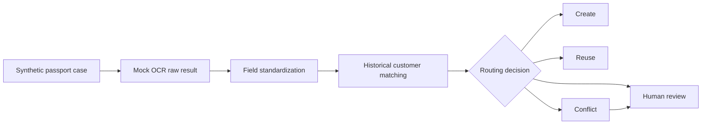

# Passport OCR Record Matching Demo

A lightweight, privacy-preserving demonstration of how raw OCR output can be standardized, compared with historical customer records, and routed to create, reuse, conflict, or human-review outcomes.

> Project status: repository skeleton complete. All future records in this repository will be synthetic.

## Why this project exists

OCR can extract text from a document, but it cannot safely decide how that text should update a customer record. This demo focuses on the business rules between OCR extraction and record handling: preserving raw values, standardizing fields, comparing identity information, preventing unsafe overwrites, and escalating ambiguous cases for human review.

The project is an independent portfolio demonstration inspired by general workflow experience. It is not a copy of any production system.

## Demo workflow



All OCR-derived outputs remain `UNVERIFIED`. A routing result is a recommendation, not an automatic identity confirmation.

## In scope

- 50-100 reproducible synthetic processing cases
- Mock OCR results with controlled missing values and recognition errors
- Conservative normalization of names, passport numbers, dates, and categorical fields
- Explainable customer matching and conflict rules
- Human-review routing with visible reasons
- A single-page Streamlit demo
- Three primary metrics: critical-field completeness, automatic reuse rate, and human-review rate

## Out of scope

- Production OCR model training or accuracy claims
- Real passport images, customer records, company code, credentials, or internal configuration
- Login, permissions, private file storage, asynchronous queues, or production deployment
- Visa case scheduling, document supplementation, risk approval, or downstream system integration
- A large analytical dashboard or an end-to-end EDMS rebuild

## Repository structure

```text
passport-ocr-record-matching-demo/
├── app.py                         # Streamlit entry point
├── src/                           # Normalization, matching, and metrics logic
├── scripts/                       # Reproducible synthetic-data generator
├── data/
│   ├── generated/                 # Public synthetic input data
│   └── processed/                 # Derived demo results
├── tests/                         # Small rule and data-quality tests
├── docs/                          # Scope and data dictionary
├── assets/                        # Final screenshots or demo GIF
├── PRIVACY.md                     # Public privacy and provenance statement
└── requirements.txt               # Minimal Python dependencies
```

## Planned local run

```bash
python -m venv .venv
source .venv/bin/activate
python -m pip install -r requirements.txt
streamlit run app.py
```

Implementation and verified run instructions will be completed incrementally.

## Portfolio boundary

The public repository demonstrates an independently rebuilt, simplified decision workflow using synthetic data. It does not claim to reproduce a client's production system, operational metrics, proprietary rules, or OCR model performance.
