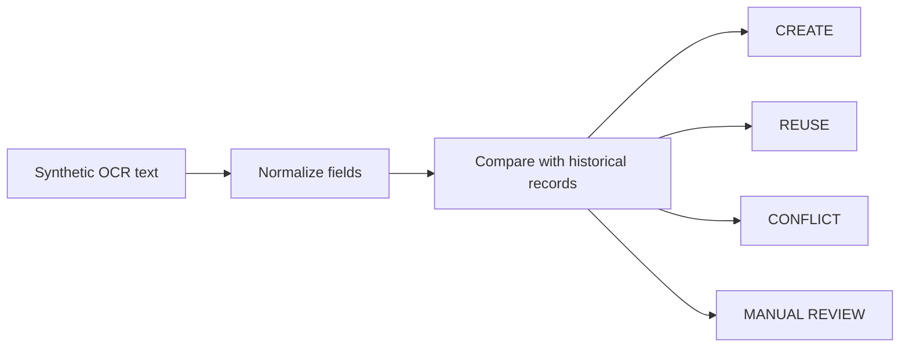
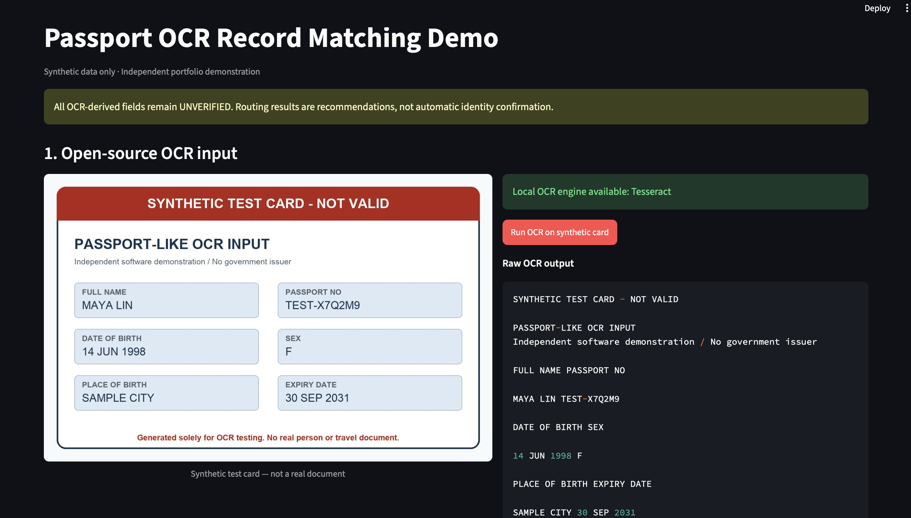
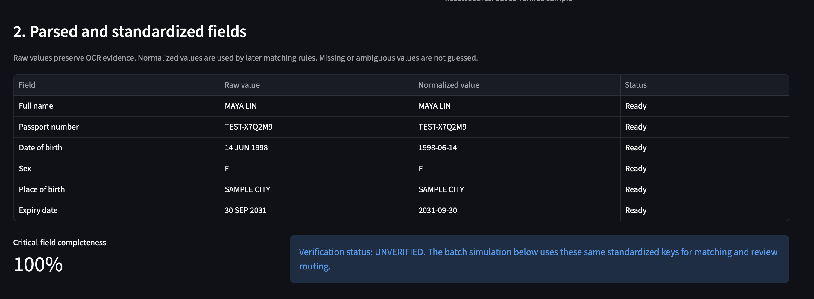
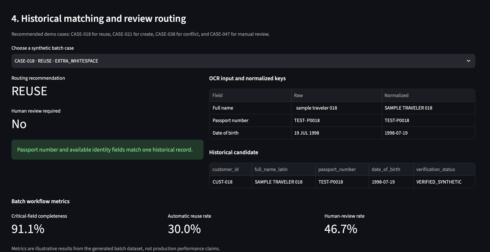
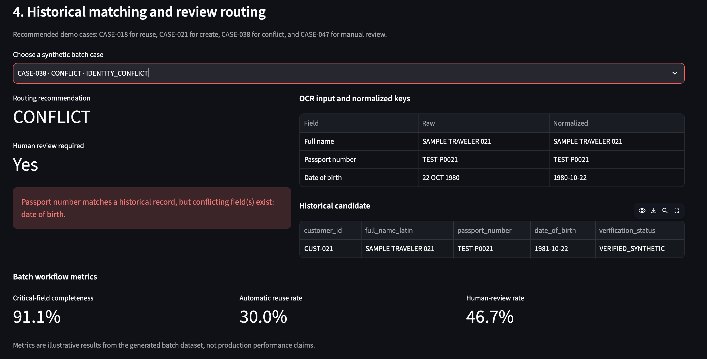

# Synthetic OCR-to-Record Routing Demo

This project demonstrates a small rule-based workflow for routing OCR-derived
identity fields.
It uses synthetic data only.

## The business problem

OCR text can contain missing values, formatting differences, or conflicts with
an existing record. This demo shows how a system can standardize fields and
decide whether to create, reuse, flag, or manually review a record.

## Workflow



## What the demo does

1. Generates a synthetic test card and reads it with local Tesseract OCR.
2. Parses the controlled test-card layout.
3. Standardizes names, passport numbers, dates, and categorical fields.
4. Compares normalized fields with synthetic historical records.
5. Routes each case to `CREATE`, `REUSE`, `CONFLICT`, or `MANUAL_REVIEW`.
6. Shows the decision reason and any matching historical record.

## Routing rules

| Condition | Route | Reason |
|---|---|---|
| Name, passport number, or date of birth is missing or ambiguous | `MANUAL_REVIEW` | A required identity key is unavailable |
| One passport-number match has no identity-field conflicts | `REUSE` | The available fields agree with one record |
| A passport number matches but another identity field conflicts | `CONFLICT` | The matching record has inconsistent information |
| Name and date of birth match but the passport number differs | `MANUAL_REVIEW` | The case needs a manual decision |
| Required fields are complete and no historical match exists | `CREATE` | No matching record was found |

## Test scenarios

The synthetic dataset contains 60 cases: 18 reuse cases, 14 create cases, 12
conflict cases, and 16 manual-review cases. These cases are used to test whether
the routing rules produce the expected decision.

The repository also includes one synthetic test card for the local OCR example
and 24 synthetic historical records for matching.

## Streamlit walkthrough

Run the app and open `http://localhost:8501`.

1. Click **Run OCR on synthetic card**.
2. Compare the raw OCR text with the standardized fields.
3. Scroll to **Historical matching and review routing**.
4. Try `CASE-018` for reuse, `CASE-021` for create, `CASE-038` for conflict,
   and `CASE-047` for manual review.

See [demo_walkthrough.md](docs/demo_walkthrough.md) for a short demo script.

## Demo screenshots

### OCR input



### Standardized fields



### Reuse case

`CASE-018` normalizes formatting differences before matching one historical
record.



### Conflict case

`CASE-038` has a matching passport number but a conflicting date of birth, so
it is routed for review.



## Repository structure

```text
human-in-the-loop-passport-ocr-routing-demo/
├── app.py                         # Streamlit interface
├── src/                           # OCR adapter, parsing, normalization, matching, metrics
├── scripts/                       # Synthetic data and routing pipelines
├── data/
│   ├── generated/                 # Synthetic inputs and expected decisions
│   └── processed/                 # Derived routing results
├── tests/                         # Rule and data-quality checks
├── docs/                          # Scope, data dictionary, and demo script
├── assets/                        # Test card and demo screenshots
├── PRIVACY.md                     # Synthetic-data policy
├── packages.txt                   # Optional Tesseract dependency
└── requirements.txt               # Python dependencies
```

## Local setup and run

```bash
brew install tesseract
python -m venv .venv
source .venv/bin/activate
python -m pip install -r requirements.txt
python scripts/generate_test_card.py
python scripts/run_ocr_demo.py
python scripts/generate_synthetic_data.py
python scripts/process_cases.py
pytest
streamlit run app.py
```

The committed VS Code workspace setting points the Python extension to
`.venv/bin/python`. If VS Code does not select it automatically, use
**Python: Select Interpreter** and choose that path.

## Limitations

- The parser supports only the synthetic test-card layout.
- The project uses deterministic rules rather than a trained identity-matching model.
- The dataset is synthetic and cannot measure production performance.

See [PRIVACY.md](PRIVACY.md) for the synthetic-data policy.
